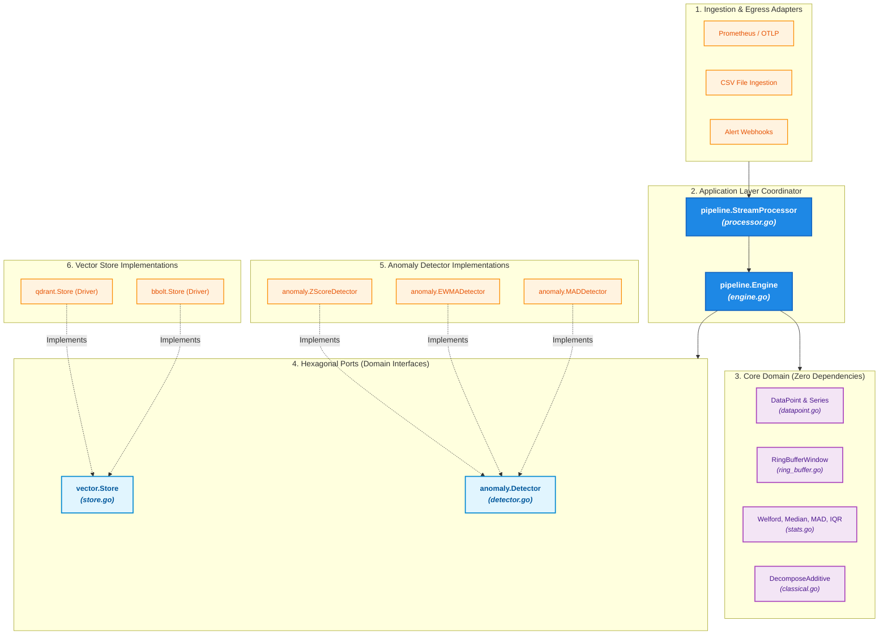

# Timescan

> A Go-Native Time-Series Analytics, Anomaly Detection & Vector Pattern Engine

---

## What Problem Does Timescan Solve?

Imagine you are running a server, a website, or a cloud application. Every second, your system produces a stream of numbers—such as CPU usage, user traffic, or memory consumption. These numbers changing over time are called **Time-Series Data**.

### The Problem
1. **Differentiating "Normal" from "Dangerous"**: Is a sudden spike in traffic just a normal morning rush, or is your server under attack? It's hard to write simple `if/else` rules because numbers fluctuate constantly.
2. **Heavy External Dependencies**: In the past, Go developers had to send their data over the internet to heavy Python microservices (running complex mathematical tools like `scikit-learn`) just to detect anomalies. This added network lag, extra servers to manage, and high infrastructure costs.
3. **Forgotten Past Incidents**: When a server crashes, IT teams often spend hours debugging, only to realize the exact same crash pattern happened 3 months ago!

---

## The Solution: How Timescan Helps

`timescan` is a lightweight, pure-Go library that you can drop directly into your Go project **with zero external setup**. It acts like an intelligent guardian for your data:

- **Automatic Spike Detection**: It continuously watches your incoming measurements in real-time and learns what "normal" looks like. If a measurement strays too far from normal, it raises an instant alert (**Anomaly Detection**).
- **Recognizing Past Crash "Shapes"**: When an incident happens, `timescan` compresses the visual graph of that incident into a small mathematical fingerprint (a **Vector**). It searches a database to tell you: *"Hey! This graph shape looks 95% identical to the outage we had last month!"*
- **Blazing Fast & Zero Memory Impact**: It processes millions of numbers per second inside Go without slowing down your application or triggering garbage collection pauses.

---

## Key Features

- **Zero-Allocation Hot Paths**: Built around a thread-safe `RingBufferWindow` and `sync.Pool` object recycling. Memory allocations won't spike your GC during massive ingestions.
- **Robust Anomaly Detectors**: Choose from Z-Score, EWMA (Exponentially Weighted Moving Average), and MAD (Median Absolute Deviation).
- **Time-Series Decomposition**: Separate complex signals into `Trend`, `Seasonality`, and `Residual` components natively.
- **Vector Pattern Matching**: Compress time-series shapes into small fixed-dimensional vectors using PAA (Piecewise Aggregate Approximation), ready to be shipped to Qdrant or Bbolt for similarity search.
- **Highly Concurrent**: The `pipeline.Engine` and `pipeline.StreamProcessor` coordinate stream channels safely and efficiently across Goroutines with context cancellation and zero leaks.

---

## Installation

```bash
go get github.com/timescan/timescan
```

---

## Quickstart & Tutorials

We've prepared several runnable examples in the [`examples/`](./examples) directory. You can run any of them directly from the terminal!

### 1. Basic Anomaly Detection
Detect sudden spikes in real-time using a 50-point rolling window and the Z-Score algorithm.
```bash
go run examples/anomaly_detection/main.go
```

### 2. Advanced Detectors (EWMA & MAD)
Standard averages fail when faced with extreme, massive outliers. See how the MAD detector ignores impossible spikes while perfectly catching real anomalies.
```bash
go run examples/ewma_mad_detectors/main.go
```

### 3. Seasonality Decomposition
Is your website traffic spiking, or is it just the normal "morning rush"? Separate the repeating daily/weekly cycles (Seasonality) from the actual underlying anomalies.
```bash
go run examples/seasonal_anomaly_detection/main.go
```

### 4. High-Performance Concurrent Monitoring
Monitor thousands of servers concurrently using Go channels and worker pools without blocking or allocating excess memory.
```bash
go run examples/concurrent_workers/main.go
```

### 5. Vector Pattern Matching (Similarity Search)
When an anomaly happens, compress the last 60 minutes of metrics into a small 8-dimensional vector (using PAA). You can send this vector to **Qdrant** to find out if this exact graph shape has ever happened in the past!
```bash
go run examples/vector_matching/main.go
```

### 6. CSV Ingestion & Backtesting
Load historical data from `.csv` files and backtest the anomaly detectors over past incidents.
```bash
go run examples/csv_ingestion/main.go
```

---

## Simple Usage Example

Here's how easy it is to embed `timescan` into your own Go code:

```go
package main

import (
	"context"
	"fmt"
	"time"
	"github.com/timescan/timescan/anomaly"
	"github.com/timescan/timescan/pipeline"
	"github.com/timescan/timescan/timeseries"
)

func main() {
	// 1. Initialize the Pipeline Engine
	engine := pipeline.NewEngine(pipeline.Config{
		WindowSize: 50,
		Detector: anomaly.NewMAD(anomaly.MADConfig{
			Threshold: 3.5, // Alert if anomaly is extremely severe
		}),
	})

	// 2. Feed data into the Engine (e.g., from an HTTP stream or Prometheus)
	dp := timeseries.DataPoint{
		Timestamp: time.Now(),
		Value:     150.5,
		Tags:      map[string]string{"host": "web-01"},
	}

	// 3. Process the data (Zero-allocation internally & Context support!)
	ctx := context.Background()
	result, _ := engine.Process(ctx, dp)

	if result.IsAnomaly {
		fmt.Printf("[ALERT] Anomaly Detected! Score: %.2f\n", result.AnomalyMeta.Score)
	}
}
```

---

## Supported Vector Databases

`timescan` provides a unified `vector.Store` interface (`Upsert`, `SearchNearest`) supporting two distinct tiers of vector storage:

### Tier 1: Embedded / Native Go Stores (Zero External Infrastructure)
- **Bbolt / BadgerDB**: Embedded KV store with a native HNSW (Hierarchical Navigable Small World) vector index in pure Go. Ideal for edge devices, CLI utilities, and single-binary applications.
- **SQLite**: Embedded relational vector search via the `sqlite-vec` extension.

### Tier 2: Enterprise / External Vector Databases
- **Qdrant (Primary Target)**: High-performance gRPC/HTTP client support with advanced payload filtering (e.g., filter by tenant or metric tags).
- **Milvus**: Large-scale distributed vector storage for massive enterprise observability clusters.
- **Pgvector (PostgreSQL)**: Native integration for setups already leveraging PostgreSQL databases.

### Key Differences Between Tier 1 and Tier 2

| Feature | Tier 1 (Embedded / Native Go) | Tier 2 (Enterprise / External DB) |
|---|---|---|
| **Architecture** | **In-Process**: Runs directly inside your Go binary. | **Client-Server**: Runs as a separate network service (Docker/K8s). |
| **Infrastructure** | **Zero Overhead**: No external servers or containers required. | Requires managing external database nodes/clusters. |
| **Network Latency** | **Zero Latency**: Direct memory / local disk I/O. | Minimal network latency over TCP (gRPC / REST). |
| **Scalability** | Single-node / Edge scale (persisted in local file like `data.db`). | Horizontal scale (sharding across multiple cloud RAM nodes). |
| **Best Used For** | Edge devices, single-binary tools, local dev, IoT agents. | Cloud clusters, enterprise multi-tenancy, shared metrics. |

> **Unified Code Base**: Thanks to the `vector.Store` interface, your Go application code remains **100% identical**! You can develop locally using **Bbolt (Tier 1)** with zero setup and switch to **Qdrant (Tier 2)** in production by simply changing your driver configuration line.

---

## Hexagonal Architecture Implementation

`timescan` strictly adheres to **Ports and Adapters (Hexagonal Architecture)**. The core mathematical domain logic is completely isolated from external databases, I/O protocols, or framework dependencies.



### 1. Core Domain (The Center)
Pure Go math, statistics, and zero-allocation memory structures with zero external imports:
- **`timeseries.DataPoint` & `timeseries.Series`** ([`timeseries/datapoint.go`](./timeseries/datapoint.go)): Base primitives for metric points.
- **`timeseries.RingBufferWindow`** ([`timeseries/ring_buffer.go`](./timeseries/ring_buffer.go)): Thread-safe sliding memory window.
- **`timeseries.Welford`**, **`Median`**, **`MAD`**, **`IQR`** ([`timeseries/stats.go`](./timeseries/stats.go)): Pure mathematical calculations.
- **`decomposition.DecomposeAdditive`** ([`decomposition/classical.go`](./decomposition/classical.go)): Signal breakdown math.

### 2. Ports (Domain Interfaces)
Decoupled interfaces defining how the core domain communicates:
- **`anomaly.Detector`** ([`anomaly/detector.go`](./anomaly/detector.go)): Defines `Detect(series)` and `IsAnomaly(point, ctx)`.
- **`vector.Store`** ([`vector/store.go`](./vector/store.go)): Defines `Upsert(ctx, id, vec, payload)` and `SearchNearest(ctx, vec, limit, filter)`.

### 3. Adapters (Concrete Implementations)
Concrete drivers implementing the Ports:
- **Anomaly Detection Adapters (implementing `anomaly.Detector`)**:
  - `anomaly.ZScoreDetector` ([`anomaly/zscore.go`](./anomaly/zscore.go))
  - `anomaly.EWMADetector` ([`anomaly/ewma.go`](./anomaly/ewma.go))
  - `anomaly.MADDetector` ([`anomaly/mad.go`](./anomaly/mad.go))
- **Vector Storage Driver Adapters (implementing `vector.Store`)**:
  - `qdrant.Store` ([`vector/driver/qdrant/store.go`](./vector/driver/qdrant/store.go))
  - `bbolt.Store` ([`vector/driver/bbolt/store.go`](./vector/driver/bbolt/store.go))

### 4. Application Layer (Pipeline Coordinator)
- **`pipeline.Engine`** ([`pipeline/engine.go`](./pipeline/engine.go)): Combines the `RingBufferWindow`, an `anomaly.Detector` Port, and a `vector.Store` Port into a unified execution flow `Engine.Process(ctx, dp)`.
- **`pipeline.StreamProcessor`** ([`pipeline/processor.go`](./pipeline/processor.go)): Manages concurrent worker pools reading from Go channels with graceful shutdown (`sync.WaitGroup`) and context cancellation (`ctx.Done()`).

---

## License
MIT License
